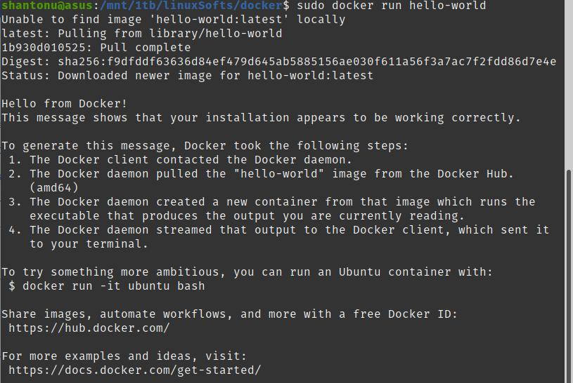

# How to install docker in POP OS 19.10
- Docker comes with mainly 3 systems togather 

# Download 
- As pop os 19.10 is based on blaster debian , download latest of these three 
- containerd : https://download.docker.com/linux/debian/dists/buster/pool/stable/amd64/containerd.io_1.2.6-3_amd64.deb
- docker-ce-cli: https://download.docker.com/linux/debian/dists/buster/pool/stable/amd64/docker-ce-cli_19.03.8~3-0~debian-buster_amd64.deb
- docker-ce : https://download.docker.com/linux/debian/dists/buster/pool/stable/amd64/docker-ce_19.03.8~3-0~debian-buster_amd64.deb

- Main page : https://download.docker.com/linux/debian/dists/buster/pool/stable/amd64/

# Install manually 
- Keep these 3 deb packages in a folder and inside the folder , open terminal
- install all of them 
      
      sudo dpkg -i *.deb
      
This will install all 

you may try to use this script 

# Test 
- in cli, run this 

            sudo docker run hello-world
           
 
